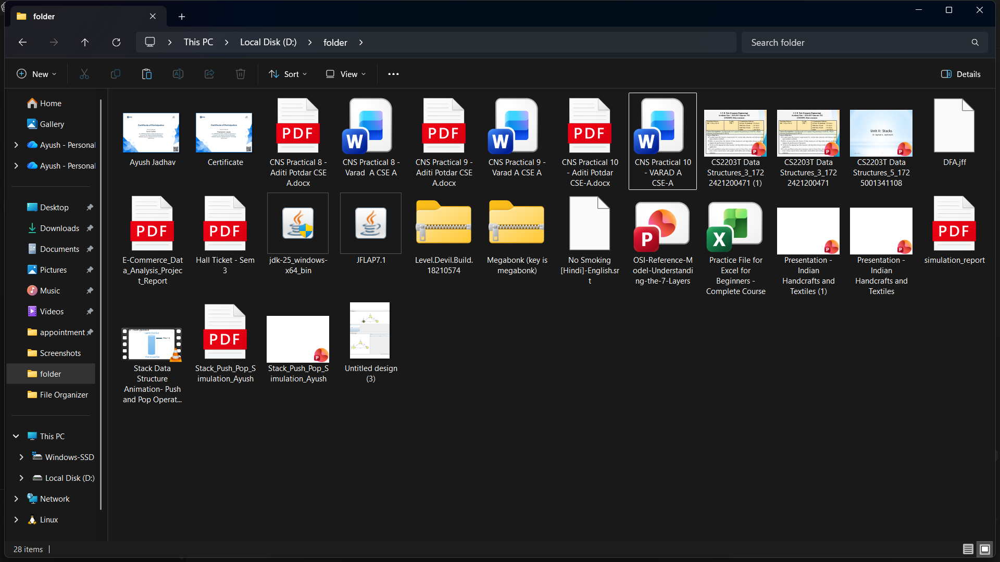
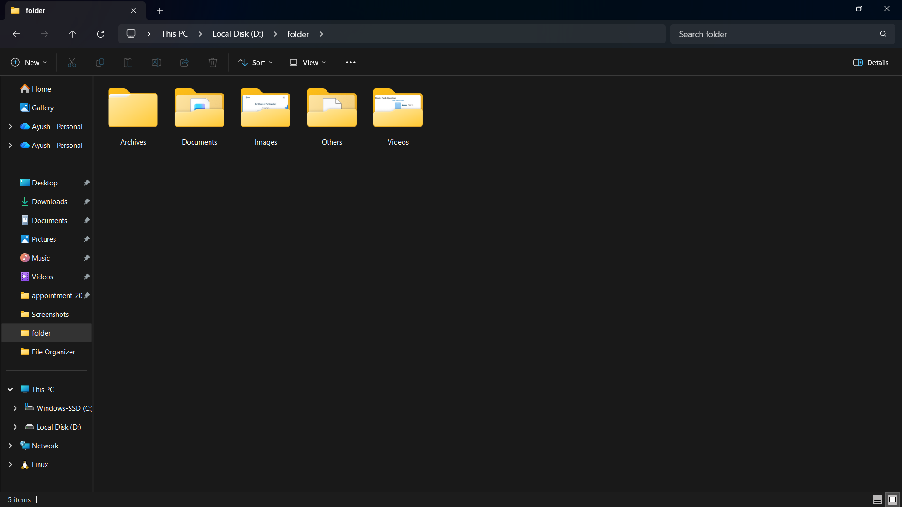

# File Organizer

A simple yet powerful Python-based File Organizer that automatically sorts your files into categorized folders like Images, Videos, Documents, Audio, Archives, Code, and Others.
It includes a GUI folder picker, logging system, and duplicate file handling — all packed into one tool.

## Features
- GUI Folder Picker using tkinter.filedialog (no manual path typing)
- Automatically creates folders for file types
- Logs every action in organizer.log
- Handles duplicate filenames smartly (_copy_1, _copy_2, etc.)
- Removes empty folders after organizing
- Optional progress bar support with tqdm
- n be converted to a .exe (no Python required!)

## Requirements
Python 3.7+
Optional dependencies:
pip install tqdm

tkinter usually comes preinstalled with Python.
If not, install it based on your OS.

## 📸 Before and After

**Before organizing:**


**After organizing:**



## Usage
1. Save/Place `file_organizer_v2.py` somewhere (e.g., Desktop).
2. Open a terminal and run:
```bash
python file_organizer_v2.py
```
3. A folder selection dialog will appear. Choose the folder to organize.
4. Confirm operation in the console.
5. After the run, check `organizer.log` next to the script for full details.

## Convert to .exe (Windows)
Install PyInstaller if you don't have it:
```bash
pip install pyinstaller
```
Then create a single-file executable:
```bash
pyinstaller --onefile file_organizer_v2.py
```
The `.exe` will be inside the `dist/` folder. Test it on a machine with the same architecture.

## Notes & Safety
- The script moves files, not copies. Always test on a dummy folder first.
- Log file (organizer.log) tracks all actions and errors.
- Use at your own discretion — especially on folders with critical files.

## License
This project is licensed under the MIT License — free for personal and commercial use.

## Author
Ayush Jadhav (CodeWithAyush)
Pune, India
Passionate about Python automation and clean code.
